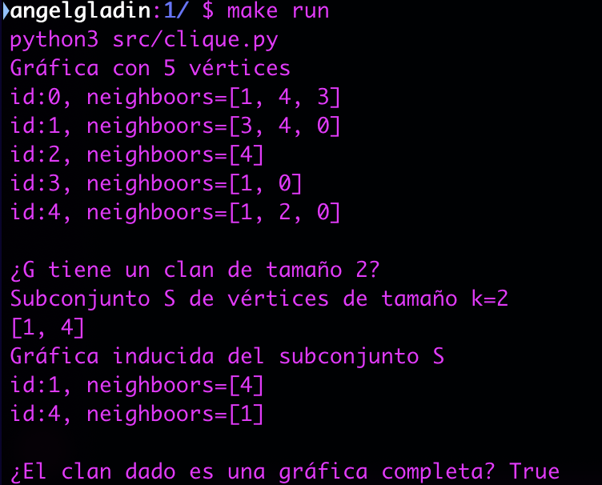

# Programa 1
## Algoritmo no determinista polinomial del *Problema del Clan*


## Información del curso

Criptografía y Seguridad - Facultad de Ciencias, UNAM.

* Profesor: María de Luz Gasca Soto
* Ayudante	José Luis Vázquez Lázaro
* Ayudante	Jorge Luis García Flores

## Descripción de la práctica

Consideradndo la versión de desición del problema del **Clan** implementar 
un algoritmo no determininístico polinomial.

En el archivo de especificación de la prática viene todo explicado 
`doc.pdf`.

## Entorno

* **`OS`**: Ubuntu 18.04.2 LTS o macOS Mojave 10.14.2
* **`Python`**: Python 3.7.0

## Ejecución del programa

Se tiene un archivo `Makefile` para la ejecución y limpieza del programa.

Para ejecutar:
```bash
$ make run
```

Para limpiar:
```bash
$ make clean
```

## Comentarios

Una vez ejecutado el programa, creará una gráfica con un número `n` aleatorio de 
vértices entre `5` y `10`, y con aristas puestas de forma aleatoria. Y se 
imprimirá en pantalla la gráfica creada.

Después se creará un subconjunto de vértices de tamaño `k` *(fase adivinadora)*, 
con `k` vértices tomados de la gráfica, para crear una gráfica inducida con esos vértices. En seguida se mostrará en pantalla la gráfica inducida
por vértices creada.

Al final se realiza la *fase verficadora* diciendo es es un clan ese subconjunto.


Ejemplo de la ejecución del programa:



## Integrante(s)

* Ángel Iván Gladín García - *(angelgladin@ciencias.unam.mx)*

