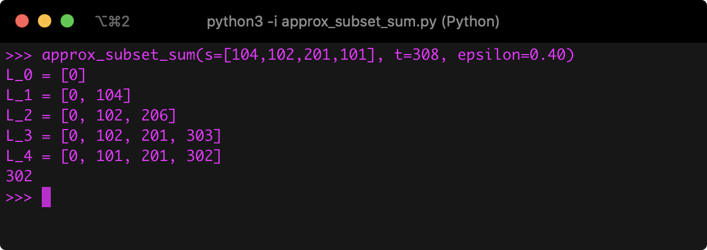
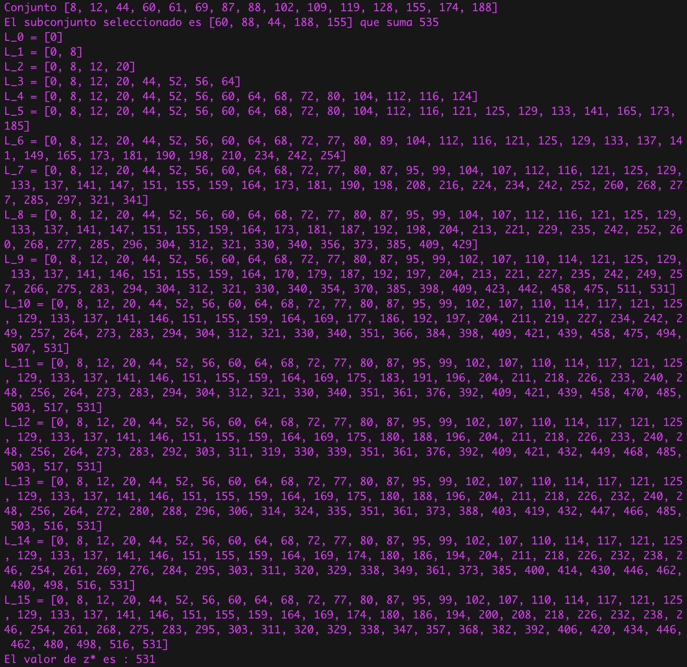
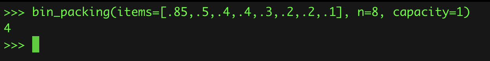
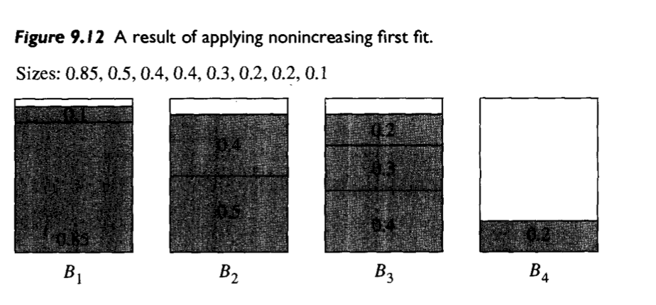
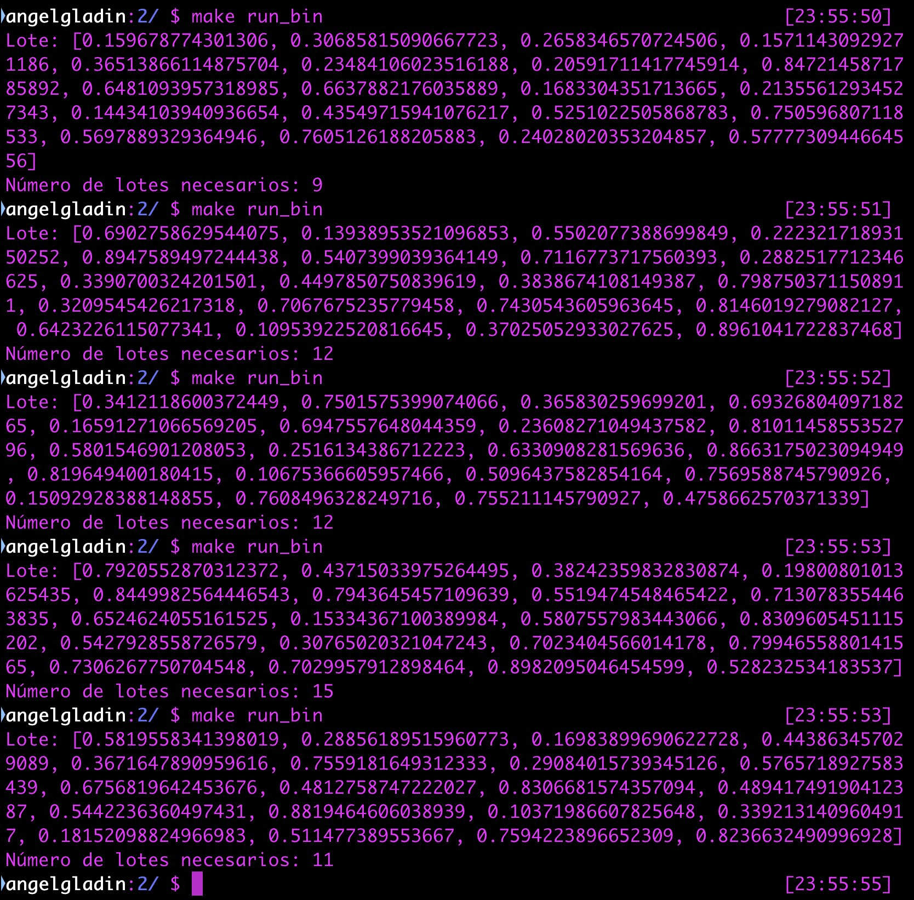

# Programa 2
## Algoritmos de aproximación


## Información del curso

Complejidad Computacional - Facultad de Ciencias, UNAM.

* Profesor: María de Luz Gasca Soto
* Ayudante	José Luis Vázquez Lázaro
* Ayudante	Jorge Luis García Flores

## Descripción de la práctica

En el archivo de especificación de la prática viene todo explicado 
`doc.pdf`.

## Entorno

* **`Python`**: Python 3.7.4

## Ejecución del programa

Se tiene un archivo `Makefile` para la ejecución y limpieza del programa.

Para ejecutar **Subset-sum**:
```bash
$ make run_subset
```

Para ejecutar **Bin Packing**:
```bash
$ make run_bin
```

Para limpiar:
```bash
$ make clean
```

## Ejecuciones

### Subset-sum

Parámetros tomados de Introduction to Algorithms de Thomas H. Cormen, en la página 1131.




Ejecución arbitraria mostrando su aproximación



### Bin Packing

Parámetros tomados de Foundations of Algorithms Using C++ Pseudocode de Richard 
E. Neapolitan y Kumarss Naimipour, en la página 399.







Ejecución arbitraria mostrando su aproximación




## Integrante(s)

* Ángel Iván Gladín García - *(angelgladin@ciencias.unam.mx)*

