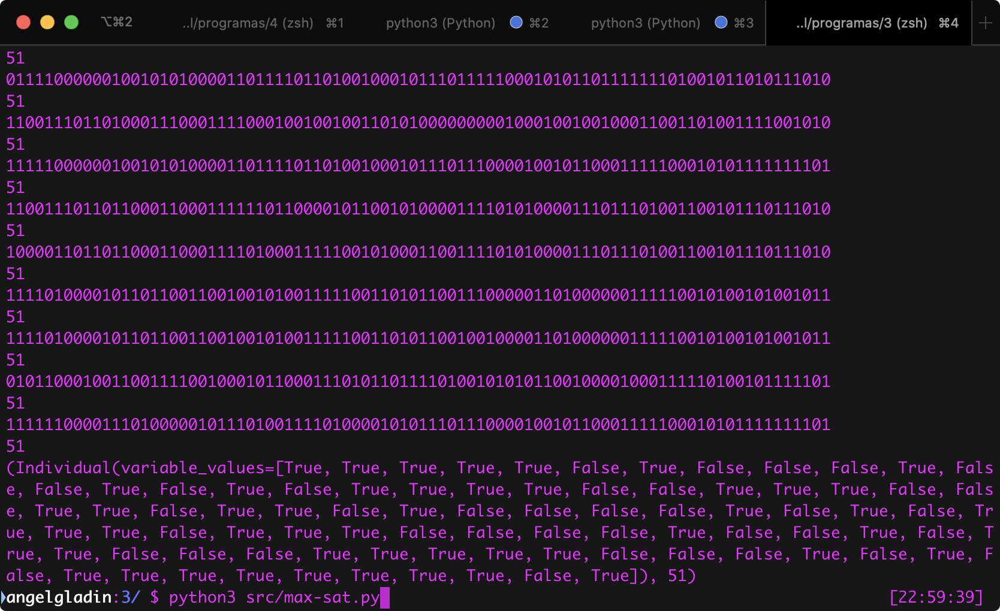
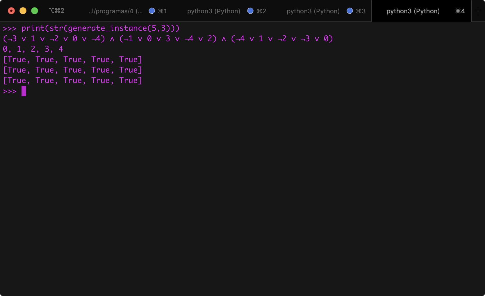

# Programa 3
## Algoritmo genético para la resolución del Problema **MAX-SAT**


## Información del curso

Complejidad Computacional - Facultad de Ciencias, UNAM.

* Profesor: María de Luz Gasca Soto
* Ayudante	José Luis Vázquez Lázaro
* Ayudante	Jorge Luis García Flores

## Descripción de la práctica

En el archivo de especificación de la prática viene todo explicado 
`doc.pdf`.

## Entorno

* **`Python`**: Python 3.7.4

## Ejecución del programa

Se deberá estar situado en la carpeta del proyecto y ejecutar

```bash
$ python3 src/max-sat.py
```



Una vez ejecutado, se mostrará cada un número que representa el *fitness* de 
la mejor solución encontrada hasta el momento seguido de su codificación como 
una cadena de bits. Se mostrará eso repetidas ocaciones.


Si se quiere experientar, se puede cambiar el valor de la *semilla* en 
*random.seed#*.

Al final, se mostrará al mejor individuo.

## Implementación

### Codificación

Para la codificación pensó en la forma de representar a las variables, 
cláusulas, la instancia del problema y finalmente el individuo.

Podemos generar una instancia pequeña para ver como es su representación 
como cadena, esto se hizo implementando el método `__str__`.

Para generar una instancia pequeña podemos cargar el script con:

```bash
$ python3 -i src/max-sat.py
```

Una vez cargado el script en el intérprete, podemos generar una instancia 
*aleatoria* con `n` variables y `m` clásulas con el siguiente comando:

```python
>>> print(str(generate_instance(5,3)))
```

Mostrando su representación de la siguiente manera:




Donde la primera línea son las clásulas en FNC. La segunda las variables 
utilizadas y la tercera la matriz $F$ donde $F_{i,j}$ nos indica si la
variable $x_j$ se encuentra en la clásula $c_i$.


### Población incial

La problación incial que utilizo la tengo en una constante

```python
INITIAL_POPULATION_SIZE: int = 500
```

### Función de evaluación *(fitness)*

En mi función `fitness` recibo un individuo que es una lista de bits que me 
indican el valor que toma cada variables y la instancia del problema y 
regreso el número de clásulas que son satisfacibles bajo un individuo.

```python
    @staticmethod
    def fitness(individual: Individual, instance: Instance) -> int:
        r: int = 0

        for c in instance.clauses:
            c_evaluated: bool = False
            for x in c.variables:
                var_name: int = x.name
                var_value: bool = individual.variable_values[var_name]
                var_value: bool = var_value if not x.is_negated else not var_value

                c_evaluated |= var_value
            if c_evaluated:
                r += 1

        return r
```

### Proceso de selección

La forma en la que selecciono un individuo del la población es tomo uno 
de forma aleatoria. En un principio le daba mayor probabilidad a los a los 
mejores, pero cuando hacía eso, le daba peso a la una función de masa de 
probabilidad que había caluclado, pero cada que hacía eso, era costoso 
computacionalmente, entonces decidí ya no hacerlo.

### Proceso de reproducción

Seguí tal cual lo que decía el documento e investigué los operadores de 
mutación y los de cruce y vi como implementarlos.

### Proceso de remplazo

Solo remplazo cuando el producto de un mutación o cruce me da mayor o igual 
*fitness* que el mejor individuo que tiene mi población.

### Terminación

Tengo una variable que dice hasta cuantas generaciones se harán, 
ósea mi condición de parada.

```python
STOP_CONDITION_MAX_ITERATIONS: int = int(1e5)
```

## Comentarios

Para ver como funcionaba el *Displacement Mutation* me basé en este
[video](https://www.youtube.com/watch?v=UgXDhdPe72M) para posteriormente 
implementarlo.

Me guié en este [sitio](http://mnemstudio.org/genetic-algorithms-mutation.htm) para 
para ver el *Exchange Mutation*.

Para ver como funciona *Order Crossover (OX)* me basé en este
[sitio](http://www.rubicite.com/Tutorials/GeneticAlgorithms/CrossoverOperators/Order1CrossoverOperator.aspx).

Para *Partial-mapped Crossover - PMX* me basé en este 
[sitio](https://www.youtube.com/watch?v=c2ft8AG8JKE&t=39s).

El Cruce *Partial-mapped Crossover - PMX* no supe como implementarlo, o bueno, 
la forma del problema no se presta a poder implementarlo.

Estuve ejecutando el programa con multiples semillas a través de 
`random.seed(n)` donde `n` es la semilla, y no logré bajo mi implementación 
obtener soluciones mejores, es decir, que tengan mayor *fitnees* que el que
se tenía inicialmente. Mi programa encontró otras posibles soluciones que al 
con el mismo *fitness* pero con valores asignados a las variables como dice 
en la especificación de la práctica a través de una cadena de bits.

En el script `max-sat.py` hay unas variables que se pueden ser modificadas para 
hacer la ejecución con otros parámetros:

```python
MIN_VARIABLES: int = 5
MAX_VARIABLES: int = 100
MIN_CLAUSES: int = 50
MAX_CLAUSES: int = 60
MIN_CLAUSE_SIZE: int = 3
MAX_CLAUSE_SIZE: int = 5

INITIAL_POPULATION_SIZE: int = 500

MUTATION_PROBABLITY_FACTOR: float = 0.2
BAD_INDIVIDUAL_BE_SELECTED_PROBABILITY: float = 0.2

STOP_CONDITION_MAX_ITERATIONS: int = int(1e5)
N_ITERATION_SHOW_PROGRESS: int = 250
```

En mi computadora que tiene un `Intel Mobile Core i5 "Kaby Lake" (I5-7360U)` 
la ejecución de programa, con los parámetros de arriba, tarda menos de 1 minutos.

En mi heurítica lo que cambiaba era mi *individuo* que es, una cadena de 
bits que representa el valor booleano de cada variable.

En ningun momento utilicé la matriz $F$ que se nos pide implementar.

## Integrante(s)

* Ángel Iván Gladín García - *angelgladin@ciencias.unam.mx*

