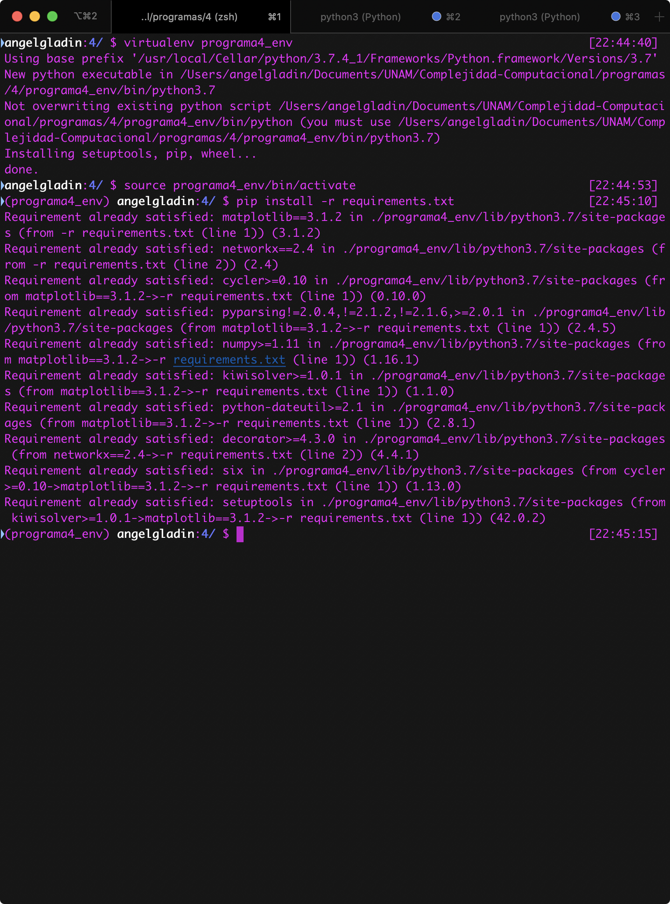
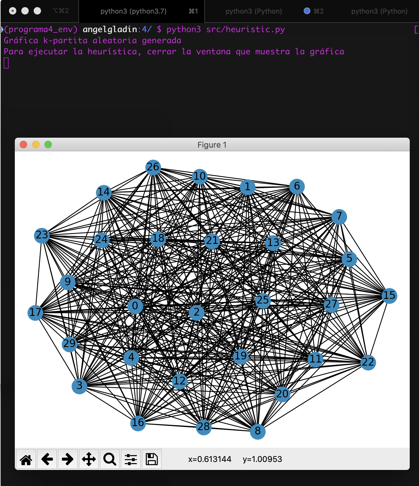
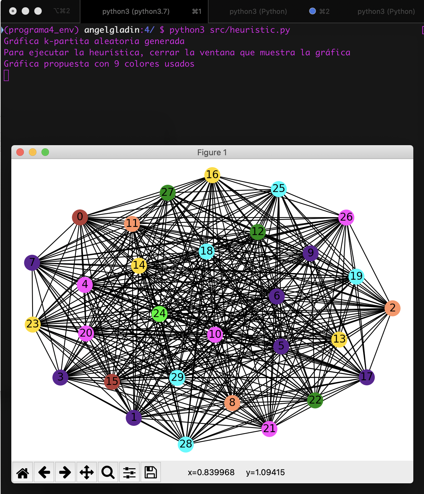

# Programa 4
## Implementación de metaheurística **DOWSLAND**


## Información del curso

Complejidad Computacional - Facultad de Ciencias, UNAM.

* Profesor: María de Luz Gasca Soto
* Ayudante	José Luis Vázquez Lázaro
* Ayudante	Jorge Luis García Flores

## Descripción de la práctica

En el archivo de especificación de la prática viene todo explicado 
`doc.pdf`.

## Entorno

* **`Python`**: Python 3.7.4
* Ambiente *Nix (Linux o macOS)

Como use bibliotecas, **recomiendo** bastante el uso uso de un ambiente virtual.
Yo use `virtualenv` para todo esto, igual se puede hacer, pero posiblemente 
haya bibliotecas en la computadora que se quiera utilizar bibliotecas que tengas conflictos.

Para instalar `virtualenv` pon lo siguiente:

```bash
$ sudo apt-get install python3-pip
$ sudo pip3 install virtualenv 
```

Una vez instalado solo falta crear el ambiente virtual e instalar las dependencias:

```bash
$ virtualenv programa4_env
$ source programa4_env/bin/activate
$ pip install -r requirements.txt
```

Con esto ya se instalaron las bibliotecas necesarias y debería aparecer así en la terminal:



Para quitar el entorno virtual solo basta con poner:

```bash
deactivate
```

## Ejecución del programa

Se deberá estar situado en la carpeta del proyecto y ejecutar

```bash
$ python3 src/heuristic.py
```

Mostrando así, una gráfica de Turan generada aletoriamente.



Después de cerrar la ventan se muestra la propuesta de la gráfica creada:




## Comentarios

Hay variables para modificar los paraámetros tanto de la gráfica como de la heurística 
situado es `src/constants.py`, con estos valores:

```python
N_GRAPH_VERTICES = 30
N_ANTS = N_GRAPH_VERTICES // 3

RANDOM_SEED: int = 666
N_CYCLES: int = 100

MIN_K_PARTITE_GRAPH_SIZE = 5
MAX_K_PARTITE_GRAPH_SIZE = 10

PARAM_ALPHA = 2
PARAM_BETA = 5
PARAM_RHO = .7
```


## Integrante(s)

* Ángel Iván Gladín García - *angelgladin@ciencias.unam.mx*
